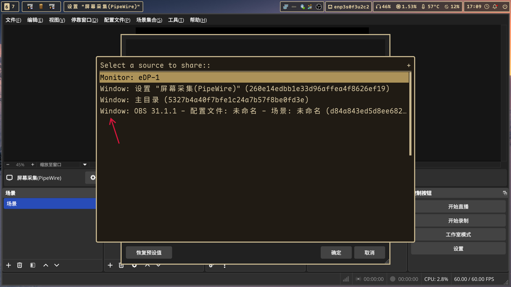

# 前言

随着 wlroots 0.20 版本的发布, xdg-desktop-portal-wlr 终于拥有了原生的窗口共享协议 ext-image-capture-source-v1, 不用再使用 slurp 选择区域了, 新协议的效果是类似 xdg-desktop-portal-gnome 的真正窗口共享, 哪怕窗口不在屏幕内部或者被其他窗口所遮挡或者半透明依旧可以完整捕获, 但是在实际体验中依旧发现了一些问题, 此文章的目的就是记录配 mangowc 时遇到的一些问题以及解决方案.



# 软件安装

由于 mangowc 的主线以及 release 线并没有合并 wlroots 0.20 的代码, 所以需要使用 text-input-v3-wlroots0.20 这个 branch 的代码, 对应 aur 中 mangowm-wlonly-git 包

```bash
paru -S mangowm-wlonly-git

sudo pacman -S xdg-desktop-portal xdg-desktop-portal-wlr xdg-desktop-portal-gtk
```

# 窗口共享

配置 mangowc 的 portal 配置

创建 ~/.config/xdg-desktop-portal/mango-portals.conf 文件, 写入

```bash
[preferred]
default=wlr;gtk
org.freedesktop.impl.portal.FileChooser=gtk
org.freedesktop.impl.portal.ScreenCast=wlr
```

新的 ext-image-capture-source-v1 协议选择窗口需要弹出一个菜单, 这个菜单可以使用支持 dmenu 协议的软件承载, 我这里使用的是 fuzzel

创建 ~/.config/xdg-desktop-portal-wlr/config 文件并写入

```bash
[screencast]
chooser_type=dmenu
chooser_cmd=fuzzel --dmenu --prompt="Select window/screen to share: "
```

由于此协议还在测试中, 目前不确定是 wayland 的问题还是 nvidia 驱动的问题, 笔记本设备在使用 obs 并添加了一个窗口捕获源的情况下, 直接进行挂起 suepend 操作后再唤醒后会导致 dbus 总线错误, 导致添加的捕获源失效, 重启 obs 也不好使, 并且会导致其他使用此协议捕获窗口的软件也会黑屏, 所以需要使用 systemd 创建 hook 重启必要服务

创建 /etc/systemd/system/restart-portals-after-suspend.service 文件, 写入

```bash
[Unit]
Description=Restart XDG Desktop Portals
After=suspend.target hybrid-sleep.target hibernate.target

[Service]
Type=oneshot
ExecStart=/usr/bin/systemctl --machine=你的用户名@.host --user restart xdg-desktop-portal.service xdg-desktop-portal-wlr.service pipewire wireplumber

[Install]
WantedBy=suspend.target hybrid-sleep.target hibernate.target
```

注意将 你的用户名 替换成你自己的用户名

注意, 由于需要使用 hiberate 的 hook, 所以必须使用系统级的 systemd 服务, 无法使用用户级别的 systemd 调用 hiberate 的 hook

启动服务

```bash
sudo systemctl start --now restart-portals-after-suspend
```

# xwayland 相关

mangowc 同时支持 原版 xorg-xwayland 以及 xwayland-satellite, 本测试在意兼容性所以使用原版 xorg-xwayland

目前存在的问题是笔记本设备在使用 nvidia 独显输出的 dp 接口连接显示器的时候开启使用 xwayland 的软件后直接进行 suspend 在唤醒后会导致软件崩溃或者卡死, 目前测试可复现的软件有 wechat-bin 以及 wps-office

解决方法如下

启用 nvidia 相关休眠服务

```bash
sudo systemctl enable --now nvidia-hibernate.service
sudo systemctl enable --now nvidia-resume.service
sudo systemctl enable --now nvidia-suspend.service
sudo systemctl enable --now nvidia-suspend-then-hibernate.service
sudo systemctl enable --now nvidia-persistenced.service
```

创建 modprobe 文件 /etc/modprobe.d/nvidia-power-management.conf, 并写入以下内容关闭内存转移

```bash
options nvidia NVreg_PreserveVideoMemoryAllocations=1
options nvidia NVreg_TemporaryFilePath=/var/tmp
```

重新生成 initramfs

```bash
mkinitcpio -P
```
